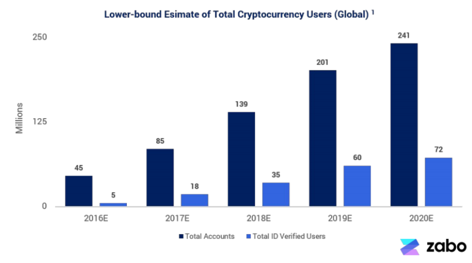
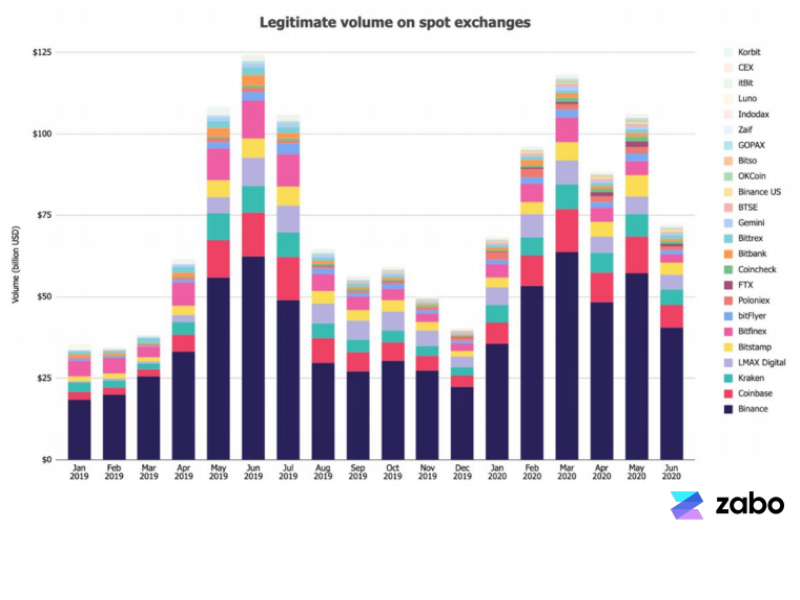
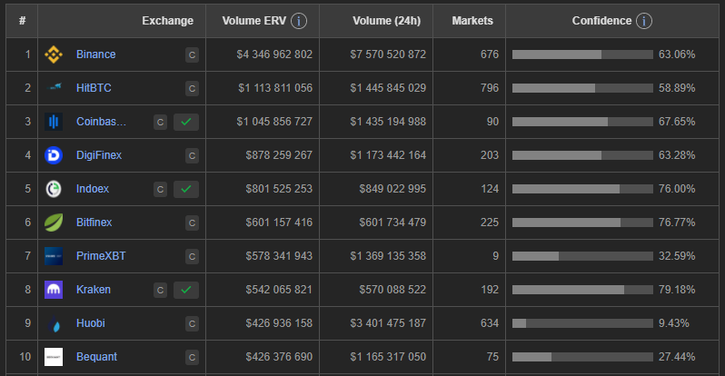

# Case Study: Kraken

 

## Overview and Origin

 

* Website: https://www.kraken.com/

* Industry: crypto, blockchain, finance

* Founded July 28, 2011 by Jesse Powell

* Powell told Bloomberg News that he began working on Kraken as a replacement for Mt. Gox after that company suffered a serious security breach in 2011 (and permanently closing in 2014)

* Kraken launced in 2013 after several years of testing and development, initially offering bitcoin, litecoin, and euro trades

* In July 2013 Kraken helped form the Committee for the Establishment of the Digital Asset Transfer Authority (DATA), with the stated aim of establishing DATA as the future self-regulatory body of the industry

* Funding History:

    + March 2014 - Kraken received a US$5 million Series A investment led by Hummingbird Ventures. Other investors included Trace Mayer and Barry Silbert (Bitcoin Opportunity Fund).

    + May 2015 - Kraken announced the beta launch of margin trading, becoming one of the few bitcoin exchanges to offer trading on margin. Initially the maximum allowed leverage for trading long or short was 3x

    + January 2016 - Kraken announced the completion of its Series B round of investment lead by SBI Investment, a prominent Japanese venture capitalist firm under SBI Holdings. Following this investment round, Kraken announced two major acquisitions that year: Dutch exchange CleverCoin and Glidera.

    + February 2019 - Kraken announced that it had raised $100 million in a direct offering to its largest customers at a $4 billion valuatio

    + June 2019 - Kraken received $13.5 million from 2,263 individual investors via a BnkToTheFuture special purpose vehicle

 

## Business Activities

 

Founder Jesse Powell recognized the importance of Bitcoin from the onset and understood “that the exchange is the most critical part of the cryptocurrency ecosystem.” Thus, Kraken is a cryptocurrency exchange that provides people the means to quickly and securely trade various cryptocurrencies. Similar in function to a stock exchange, cryptocurrency exchanges facilitate the buying and selling of virtual currencies by retail as well as large investors and traders. Participants are allowed to buy and sell cryptocurrency using various fiat currencies including the U.S dollar, Canadian dollars, euros, and the Japanese yen.

The Kraken mission statement reads:

 

> “Our mission is to accelerate the adoption of cryptocurrency so that you and the rest of the world can achieve financial freedom and inclusion.”

 

Kraken aims to support individual investors ranging in experience from crypto-beginners to advanced traders. It does this by providing access to an ever-increasing number of cryptocurrency options as well as online tools and features. Additionally, Kraken also supports institutional investors, stating:

 

> “Kraken is the premier cryptocurrency investing solution for institutions of all sizes. We offer exceptional liquidity and competitive pricing for all our markets so you can achieve your investment goals quickly and confidently”

 
Competitors in the crypto space are many, but Kraken is the oldest and most experienced. Other advantages of Kraken as compared to competitors include:

* Safe and secure - one of most trustworthy exchanges
    + Vast majority of cryptocurrency funds are stored in secure offline cold storage wallets
    + Company and user funds segregated
    + Personal accounts secured using 2-factor authentication
    + Has never been hacked

* Good variety of trading features

* Supports margin trading, futures trading

* Easy to transfer money between bank and Kraken

* Low fees - Kraken’s trading fees are generally below 0.36%

* Good customer service 

* Supports large variety of altcoins

 

## Landscape

 

Ten years ago Bitcoin and cryptocurrency were considered to be on the fringe of the financial landscape with many suggesting Bitcoin was not a real asset and overly complicated. Further, the market was seen to be a bubble. However, as early adopters began to prove conventional wisdom wrong, cryptocurrency evolved into a huge, global market with hundreds of millions of accounts. This trend change was led by millennial investors with 18% owning cryptocurrency and 42% planning to buy Bitcoin in the next five years.
  

 

The space is now highly competitive with many companies competing for users. Kraken consistently ranks in the top 10 by volume.
  

 

## Results

 

According to CoinMarketCap, Kraken is the 4th largest cryptocurrency exchange in the world (as of September 2020) and widely considered as the most sophisticated, reputable and secure by participants and observers of cryptocurrency markets. One important claim that few other exchanges can make - Kraken has never been hacked!

Common metrics used to compare crypto exchanges include:
* Volume (24h)
* Markets
* Confidence score
* Available altcoins

As can be seen in the following chart, Kraken tops all competitors in confidence with a score of 79.18%. However, volume is limited as compared to other leaders based on the number of markets supported.
   

 

**In the news**

In September 2020 Kraken became the first digital asset company to receive a U.S. bank charter recognized under state and federal law. Through the charter, Wyoming will allow Kraken to form the world’s first Special Purpose Depository Institution (SPDI) named ‘Kraken Financial’, which will be regulated like any other bank. This means that customers of Kraken Financial will have traditional banking services for both fiat and digital assets including:
* Payment of bills in crypto
* Receiving salaries in crypto
* Adding digital assets to their investment and trading portfolios  

Speaking to Forbes, Chief Legal Officer at Kraken Marco Santori, said this:

> "I think it is difficult to state the over-importance of this milestone. I think this is a specific development in the course of crypto affairs. This represents the development of an efficient, transparent, responsible nexus between the world of traditional finance and the developing crypto ecosystem. I think this is a historical time and the kind of thing that students of finance and history will look back on as a watershed moment for the development of financial assets"

  

## Recommendations

 

It seems that one of the major drawbacks for users of the Kraken exchange is usabilty. 

* Hire UX engineers and improve website usability. The cost for this improvement would be minimul and could allow Kraken to reach many novice users and increase adoption.

* Add support for debit cards (Coinbase support this)

It appears the biggest obstacle to growth is the limited number of markets Kraken reaches. As compared to industry leader Binance (676 markets), Kraken only reaches 192 markets. 

  

## Definitions

 

* ERV (Estimated Real Volume) - estimate of genuine volume (24h) based on liquidity. Eliminates ~90% wash-trading activity and preserves legitimate volume. (https://coinpaprika.com/exchanges/)

* Confidence - evaluates exchange based on (https://coinpaprika.com/exchanges/):
    + liquidity (75% weight)
    + Web Traffic (20% weight)
    + Regulations (5% weight)

 

## References

 

* https://www.kraken.com/

* https://en.wikipedia.org/wiki/Kraken_(company)#cite_note-3

* https://coincentral.com/coinbase-vs-kraken/

* https://www.investopedia.com/tech/what-kraken/

* https://gocryptowise.com/blog/top-crypto-exchanges/

* https://cdn.zabo.com/reports/Fintech_Adoption_of_Crypto_Zabo_July2020.pdf

* https://coinpaprika.com/exchanges/kraken/

* https://insidebitcoins.com/

* https://www.forbes.com/sites/jasonbrett/2020/09/16/cracking-landlocked-wyoming-kraken-wins-first-crypto-bank-charter-in-us-history

* https://www.nasdaq.com/articles/kraken-crypto-exchange-receives-unique-charter-to-operate-as-a-bank-2020-09-21

